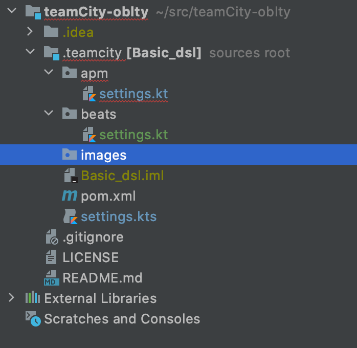

# teamCity-oblty
Test Project for TemaCity

* Create the Project in TeamCity UI
    * Configure VCS Roots
      * Add a new repo configuration
    * Configure **Versioned Settings**
      * Synchronization enabled
      * use settings from VCS
      * Push changes to the repo with **Commit current project settings…** button
* Clone the repo locally
* Edit the `.teamcity/settings.kts`
  * add a new BuiltType
  ```
  import jetbrains.buildServer.configs.kotlin.v2019_2.buildSteps.script
  
  [](#)
  
  ...
  
    project {
      // repository to save project changes (this repo)
      vcsRoot(BuildConfVcs)
    
      // Build configuration 
      buildType(MyTest)
    }
  
  ...
  
    object MyTest : BuildType({
      name = "Build"
      steps {
          script {
              scriptContent = "echo 'Hello world'"
          }
      }
    }
  
  ...
  
    object BuildConfVcs : GitVcsRoot({
        name = "APMAgentPython"
        url = "https://github.com/elastic/apm-agent-python.git"
    })
  ```
* Push the changes to the repo
* Update the project configuration on TeamCity UI 
    * Open the project in TeamCity UI
    * Go to **Versioned Settings** to the tab **Change log**
    * Check for changes by click on **Check for changes** button
    * Check configuration tab on the botton, **Current status** to see the update results.


A TeamCity project is like a folder in Jenkins and it contains subprojects(Jenkins folders)
and build configurations (Jobs). 

# Sequential Build configurations

```
project {
    vcsRoot(BuildConfVcs)

    // You have to define the build configurations
    buildType(Basic)
    buildType(BasicFromGit)

    // You set the way to execute them
    sequential {
        buildType(Basic)
        buildType(BasicFromGit)
    }
}
```

# Parallel Build configurations

```
project {
    vcsRoot(BuildConfVcs)

    // You have to define the build configurations
    buildType(Basic)
    buildType(BasicFromGit)

    // You set the way to execute them
    sequential {
        // parallel should be inside a sequential block
        parallel {
            buildType(Basic)
            buildType(BasicFromGit)
        }
    }
}
```

# Dynamic Parallel Build configurations

```
val operatingSystems = listOf("Mac OS X", "Windows", "Linux")
val pythonVersions = listOf("2.7", "3.5", "3.7")

project {
    vcsRoot(BuildConfVcs)
    buildType(ApmAgentPythonMain)
    operatingSystems.forEach() {os ->
        pythonVersions.forEach(){ version ->
            buildType(ApmAgentPythonAxis(os, version))
        }
    }

    sequential {
        buildType(ApmAgentPythonMain)
        parallel {
            operatingSystems.forEach() {os ->
                pythonVersions.forEach(){ version ->
                    buildType(ApmAgentPythonAxis(os, version))
                }
            }
        }
    }
}

...

class ApmAgentPythonAxis(val os: String, val version: String) : BuildType ({
    id("APM_agent_Python_${os}_${version}".toId())
    name = "Agent Python ${os} ${version}"

...
}
```

# SubProjects

We create one folder per subproject, on each subfolder there are a file `settings.kt`
This file defines the project and first level subproject in that folder.
The reason to use the same name for the file is to have a common structure along all folders.
Also have the configuration of each project in its folders 
makes easy to find the configuration and edit it.



The settings.kt file looks like the following

```
package apm.server

import jetbrains.buildServer.configs.kotlin.v2019_2.*
import jetbrains.buildServer.configs.kotlin.v2019_2.vcs.GitVcsRoot

class ApmServerProject: Project ({
    id("apm_project")
    name = "APM"

    vcsRoot(ApmServerVcs)
})

object ApmServerVcs : GitVcsRoot({
    name = "APMServer"
    url = "https://github.com/elastic/apm-server.git"
})
```

The Project class defined in that file is used in the upper level to import as subproject.

root `settings.kts` (notices the 's' at the end)
```
import apm.ApmProject
import beats.BeatsProject

version = "2020.1"

project {
    subProject(ApmProject())
    subProject(BeatsProject())
}
```

Apm project `settings.kt`
```
import apm.agents.ApmAgentsProject
import apm.agents.ApmServerProject

project {
    subProject(ApmAgentsProject())
    subProject(ApmServerProject())
}
```